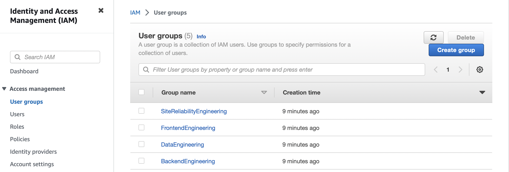

# IAM RBAC implementation for Brightwheel's engineering teams using AWS Console

1. Create AWS IAM Groups for each team with the necessary permissions:
  - Frontend Engineering Group: Access to CloudFront
  - Backend Engineering Group: Access to EKS
  - Data Engineering Group: Access to Redshift
  - Site Reliability Engineering Group: Administrator Access
2. Create AWS IAM Policies for each group:
  - Frontend Engineering Policy: Allow necessary CloudFront actions
  - Backend Engineering Policy: Allow necessary EKS actions
  - Data Engineering Policy: Allow necessary Redshift actions
  - Site Reliability Engineering Policy: Allow all actions
3. Attach the policies to the corresponding IAM groups.
4. Create AWS IAM Users for each team member and add them to the appropriate IAM group.
5. Implement AWS Organizations to separate environments (Dev, QA, and Production) into different AWS accounts. This will help with cost analysis, security, and resource isolation.
6. Use AWS CloudTrail for monitoring and logging all AWS API calls made by IAM users and roles.
7. Implement AWS Config for continuous monitoring and assessment of AWS resource configurations.
8. Use AWS Budgets and Cost Explorer for cost analysis and budget management.

# IAM RBAC implementation for Brightwheel's engineering teams using Terraform

Clone this repository and initiate these commands accordingly:
- terraform init (Initializes Terraform working directory by downloading necessary provider plugins and setting up backend storage for the state file)
- terraform plan (Generates an execution plan, showing the changes that Terraform will make to your infrastructure based on your configuration files)
- terraform apply (Applies the changes proposed in the execution plan to your infrastructure, creating, updating, or deleting resources as needed)

## Given more time, the next steps in the project would be:
- Implement AWS Single Sign-On (SSO) for centralized user management and access control.
- Create a more fine-grained set of IAM policies for each team, limiting permissions to only the necessary actions and resources.
- Implement AWS Service Control Policies (SCPs) to prevent privilege escalation and enforce organization-wide policies.
- Set up monitoring and alerting using Amazon CloudWatch and AWS Lambda for automated incident response.
- Implement infrastructure as code for other AWS services used by the teams, such as EKS, CloudFront, and Redshift.

After successfull implementation, you should have something like this:

